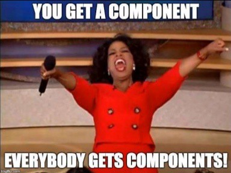

# 0x03. React component
`Front-end ` `JavaScript` `Es6` `React`

# Resources
**Read or watch:**
* [React components](https://reactjs.org/docs/react-component.html)
* [React Developer Tools](https://chrome.google.com/webstore/detail/react-developer-tools/fmkadmapgofadopljbjfkapdkoienihi)
* [Enzyme Shallow](https://enzymejs.github.io/enzyme/docs/api/shallow.html)
* [Enzyme Mount](https://enzymejs.github.io/enzyme/docs/api/ReactWrapper/mount.html)
* [Enzyme Unmount](https://enzymejs.github.io/enzyme/docs/api/ReactWrapper/unmount.html)
* [React Pure components]()
* [React Higher Order Components](https://reactjs.org/docs/react-api.html#reactpurecomponent)
* [Jest mock function](https://jestjs.io/docs/jest-object)

## Learning Objectives
At the end of this project, you are expected to be able to explain to anyone, without the help of **Google:**

* When to use a Class or a function to create a component
* The lifecycle of a Class component
* How to test a component
* How to utilize a Jest spy to verify that a function is being called correctly
* What an HOC is and how to use it
* How to optimize performance and control which components to render
